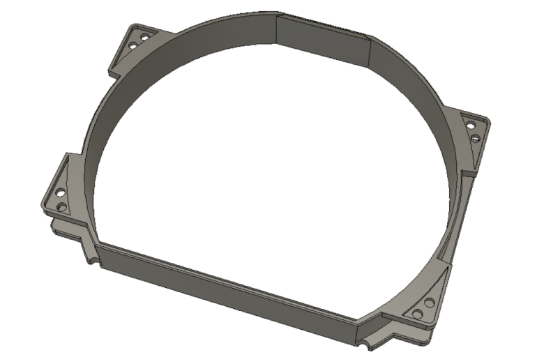

# NH-D15 fan spacer

This spacer is made for 140mm NF-A15 fan in order to improve RAM compatibility with the NH-D15.
It is compatible with stock NA-SAVP3 anti-vibration pads.

The current spacer is 21mm thick but this could be change in the by editing the Fusion 360 file.
